# VC Notice
VC Noticeは指定されたDiscordのVCを監視し、ユーザーの入退室を通知するbotです。  
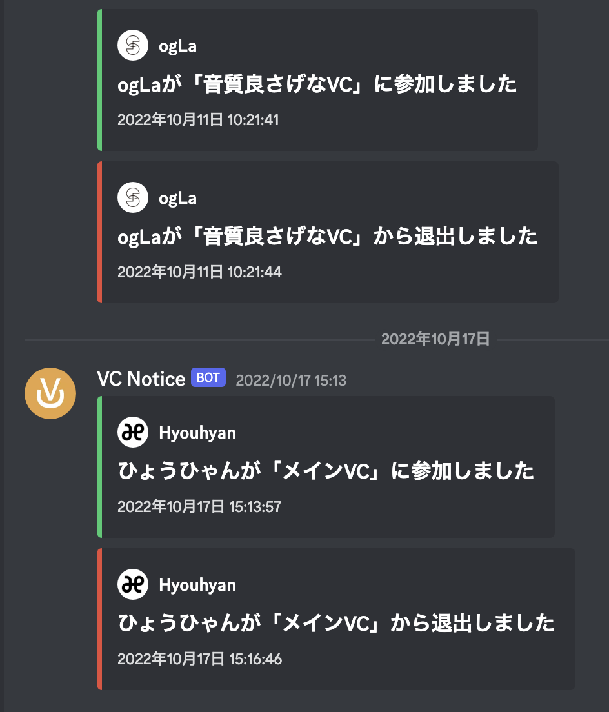


# セットアップ
VC Noticeを運用するためには以下の手順を踏む必要があります。  

1. Discord Developer PortalでBotを作成
2. Pythonのダウンロードとインストール
3. VC Noticeのダウンロードと実行

ざっとこんな感じです。  
これだけだと随分あいまいなので、細かく説明していきます。


## Discord Developer PortalでBotを作成

1. [Discord Developer Portal](https://discord.com/developers/applications)にアクセス
2. 右上の「New Application」をクリック  
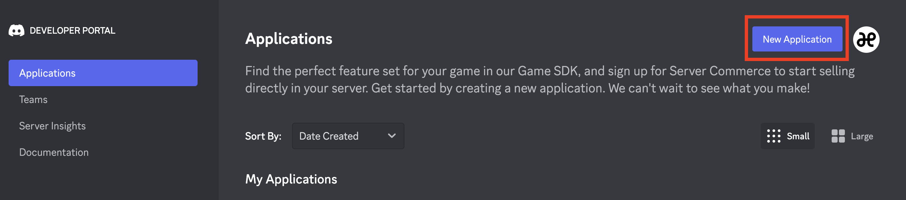
3. 設定したいbotの名前を入力後、チェックを入れて「Create」  
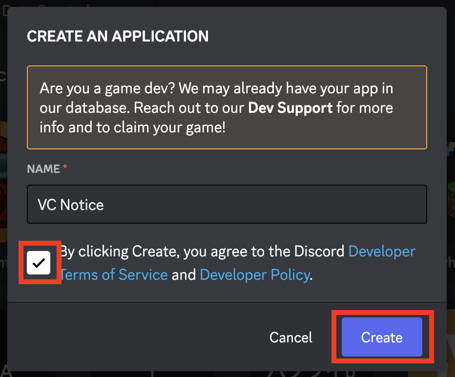
4. Bot欄から「Add Bot」をクリック  
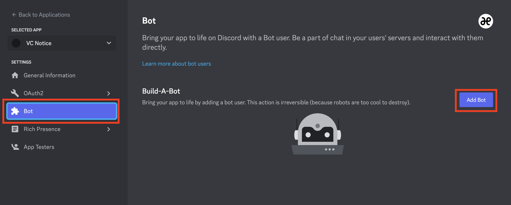
5. 「Yes, do it!」をクリック  

6. 画面上に表示されるトークンをメモしてください  
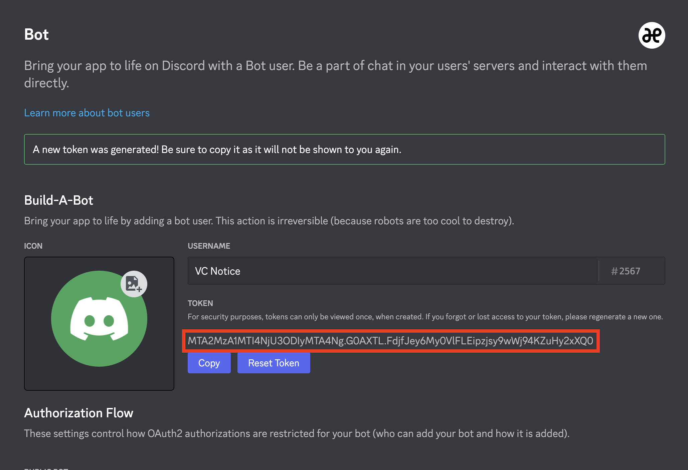


## Pythonのダウンロードとインストール

### Linux(Ubuntu, Debian)の場合
1. ターミナルを起動
2. `$ sudo apt -y install python3.10` を実行
3. `$ python3 -V`を実行してエラーが出ないことを確認
4. `$ python3 -m pip install discord.py`を実行
5. エラーが発生しなければ成功

### Windowsの場合

1. [Python公式ページ](https://www.python.org/downloads/)からインストーラをダウンロード  
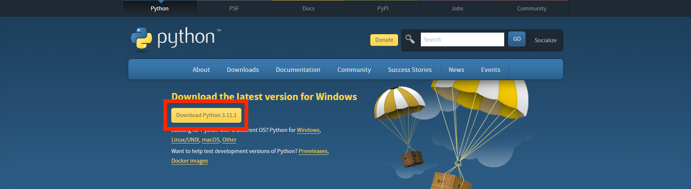
2. インストーラーを開く  
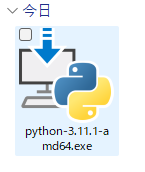
3. Install Nowをクリック  
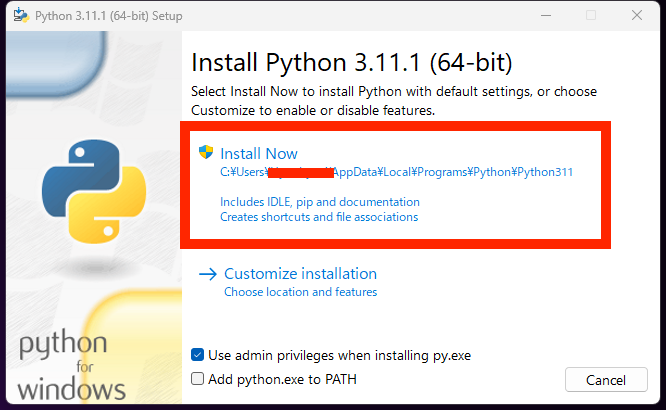
4. 待ちます  
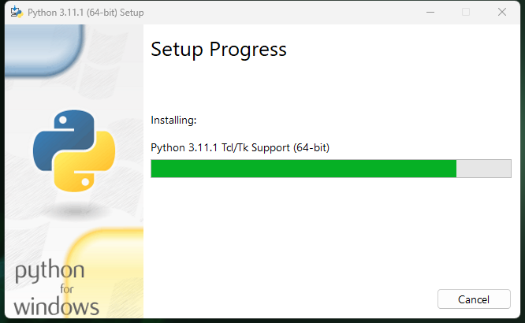
5. Closeをクリック  
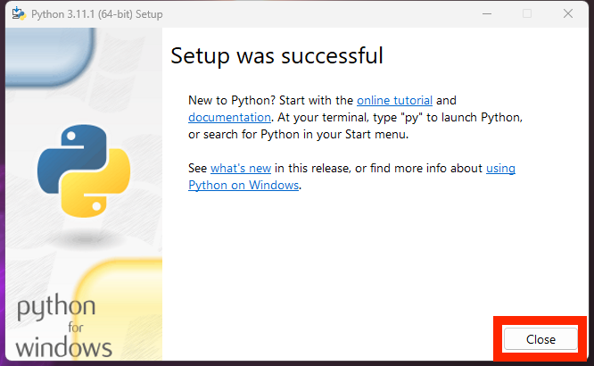
6. コマンドプロンプトを起動
7. `python3 -V`を実行してエラーが出ないことを確認
8. `$ python3 -m pip install discord.py`を実行
9. エラーが発生しなければ成功

MacもWindowsと同様でインストーラー開いてポチポチしてればできます。

## VC Noticeのダウンロードと実行
1. [こちら](https://github.com/ogLa-Production/VC-Notice/releases/latest)からVC-Notice.zipファイルをダウンロード
2. zipファイルを解凍し、TOKEN.txt内の`WriteYourBotToken`を削除し、自分のトークンを記入して保存  
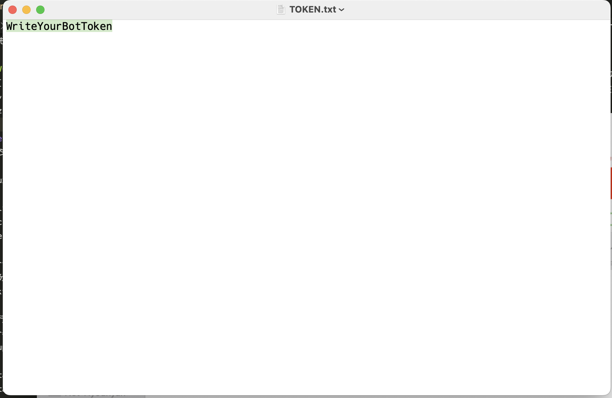
1. ターミナルにて`python main.py`を実行するとbotを起動できます

Linuxの方は以下のようなserviceファイルを作成し、systemctlで管理することをお勧めします。
```
[Unit]
Description=VC Notice
After=network.target

[Service]
#自分の作業ディレクトリを指定
WorkingDirectory=/home/ogla/vcnotice

#実行ユーザーを指定
User=root
Group=root

Restart=always
RestartSec=10

ExecStart=/usr/bin/screen -DmS disc-vcnotice /usr/bin/python3 main.py

ExecStop=/bin/kill -s INT $MAINPID

[Install]
WantedBy=multi-user.target
```